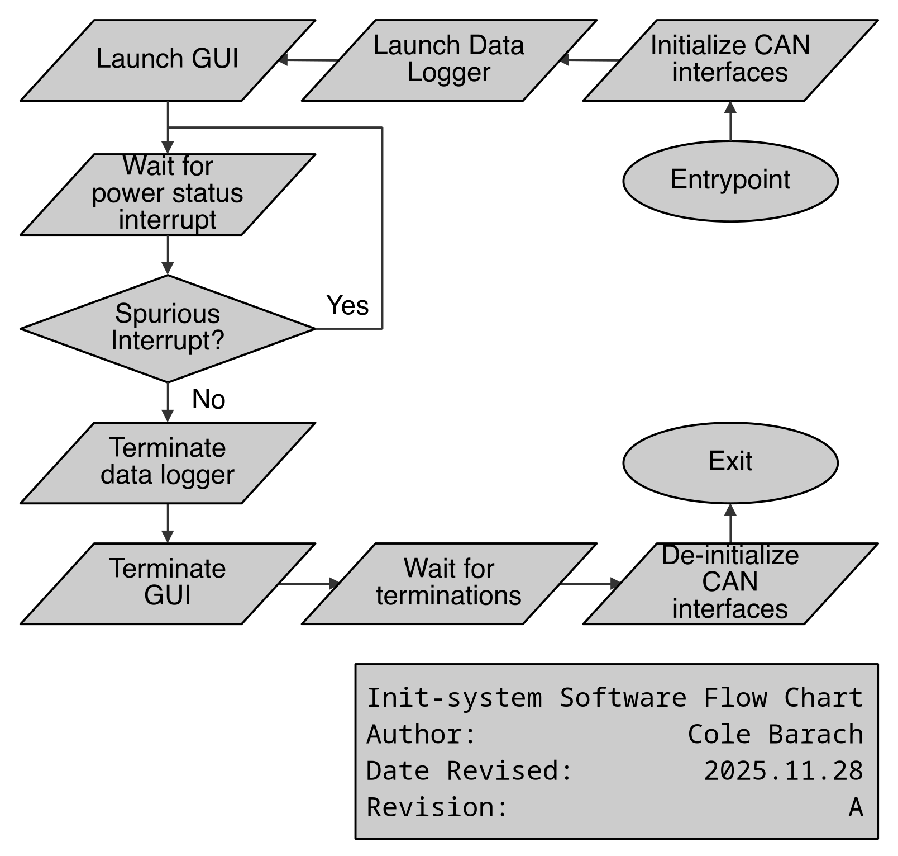

# The Init-System Application

// TODO(Barach): Waaaay too text heavy.

The init-system is responsible for integrating both the GUI and the data logging applications. The main goal of the init-system is to launch said applications when the device boots and terminate said applications when the system is powering down. The device’s power down sequence is signaled by the power input subsystem via hardware, hence the need to isolate this functionality in the init-system. The init-system is also responsible for bringing the CAN interface hardware online and configuring it for the correct baudrates. Even though multiple applications can share access to this hardware, only one application may perform this initialization. Because of this, the data logger and GUI are designed to expect this initialization be performed before they are launched.



## GPIO

### Permissions

By default, non-root users do not have access to the `gpiochip` devices. To grant a user permission to system devices, a group must be created to control this access. Any user added to said group will have read/write access as specified by the group's access.

The below commands will create a new group to be granted gpio access (named `gpio`) and add the user `zre` to said group.

```
sudo groupadd -r gpio
sudo usermod -aG gpio zre
```

The `/etc/udev/rules.d` directory contains the rules files of the system. These files define rules for device access. By creating a new file in here, the rules for the `gpiochip` device can be modified to allow access to the `gpio` group.

In file `/etc/udev/rules.d/60-gpio.rules`
```
# TODO(Barach): Docs
SUBSYSTEM=="gpio", KERNEL=="gpiochip[0-4]", GROUP="gpio", MODE="0660"
```