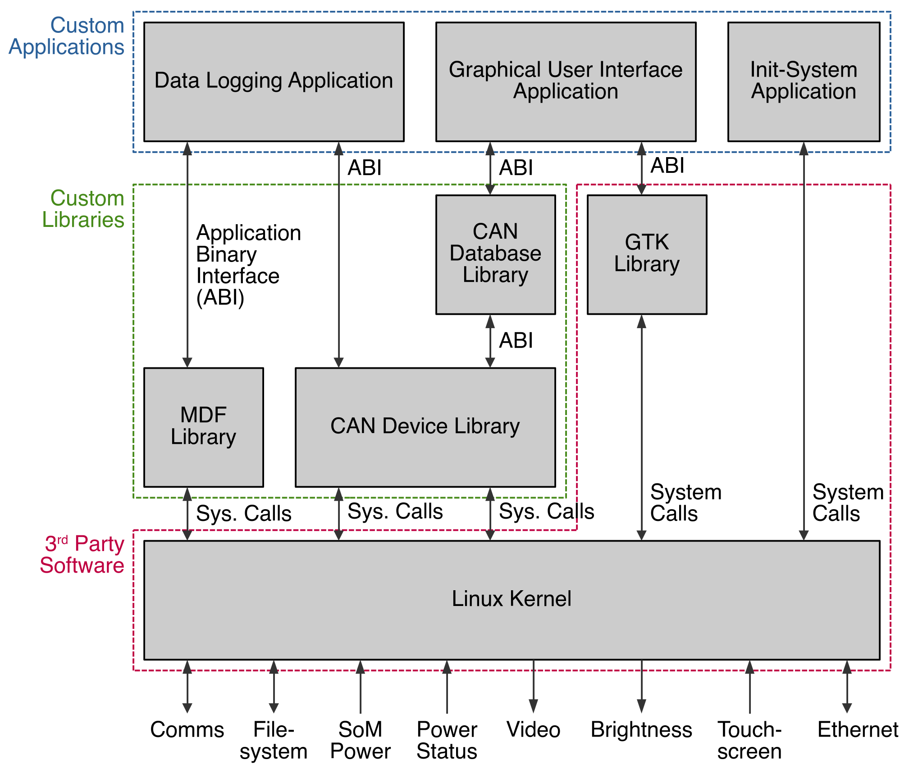

# Dashboard and Racing Telemetry (DART) - Zips Racing

Firmware and operating system creation tool for Zips Racing's DART data acquisition system.

## Project Information

This project can only be installed on a Raspberry Pi running Raspberry Pi OS, similar hardware, or a virtual machine. This is due to the fact that a 64-bit ARM compiler and Debian ARM packages are required to generate the OS image. For accessing pre-built images, see the [Releases](https://github.com/ZipsRacingElectric/ZRE-DARTOS/releases) section of this repository.

### Usage

TODO(Barach): Does RPi recommend adding to system path, or should we use a submodule for version stability?

Working in this directory:
```
../rpi-image-gen/rpi-image-gen build -S . -c dart.yaml
```

## Software Architecture

The system's software is divided into 3 core applications:
- The dashboard graphical user interface (GUI)
- The data logging application
- The init-system application

With this design, the GUI and data logger are completely independent and portable, meaning development can be done independent of the system’s hardware. The responsibilities and details of these applications is discussed below.



### The Init-System Application

The init-system is the first (custom) application run when the operating system boots. Note that this application does not fill the role of the operating system's primary init-system (that is still systemd), rather it acts as a secondary one, being launched itself by the primary init system. The init-system is also responsible for gracefully terminating all custom applications upon detecting the device has lost power.

Technical documentation for the init-system can be found at:

[doc/init_system_application.md](doc/init_system_application.md)

### The Dashboard GUI Application

The dashboard GUI is the application responsible for rendering the dashboard's display. Launched by the init-system, this application parses out relevant information from the device's CAN busses and renders it the the device's display. As this application is part of the ZRE-CAN-Tools project, its source code and documentation can be found in said project's repository:

[https://github.com/ZipsRacingElectric/ZRE-CAN-Tools](https://github.com/ZipsRacingElectric/ZRE-CAN-Tools)

### The Data Logging Application

The data logging application is responsible for logging all traffic on the device's CAN busses. Launched by the init-system, this application runs in the background of the device. A periodic status message is broadcast onto both CAN busses, allowing the dashboard GUI to indicate whether the data logger is running or has failed. As this application is part of the ZRE-CAN-Tools project, its source code and documentation can be found in said project's repository:

[https://github.com/ZipsRacingElectric/ZRE-CAN-Tools](https://github.com/ZipsRacingElectric/ZRE-CAN-Tools)

## CAN Bus Configuration

The DART exposes 2 CAN busses for interacting with the vehicle's low-voltage electrical systems. The Raspberry Pi Compute Module does not come with CAN hardware, however there is quite a bit of support built into the Linux kernel. This is discussed further in the below file:

[doc/can_bus_configuration.md](doc/can_bus_configuration.md)

## Ethernet Configuration

The DART exposes an ethernet connection to allow data log retrieval. When a host computer is connected to the ethernet port, the DART automatically assigns it an IP address. The host computer can then create an SSH connection using the DART's static IP address, allowing it to copy, move, and delete data logs as necessary. This connection can also be used to update the DART's firmware. In order for this process to work, the DART must host a DHCP server and be bound to a static IP address. This is discussed further in the below file:

[doc/ethernet_configuration.md](doc/ethernet_configuration.md)

Having a static IP address alone is not enough for the host computer to communicate with the DART, this IP address must be known to both devices. To solve this, all DART devices are configured with the below IP address.

`192.168.0.1`

**This should not be changed unless all DART devices and all host PCs are updated accordingly.**